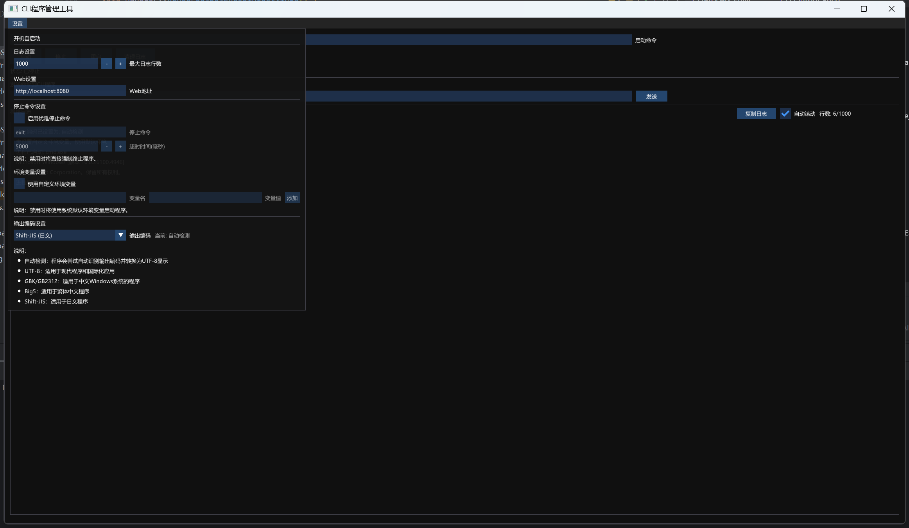
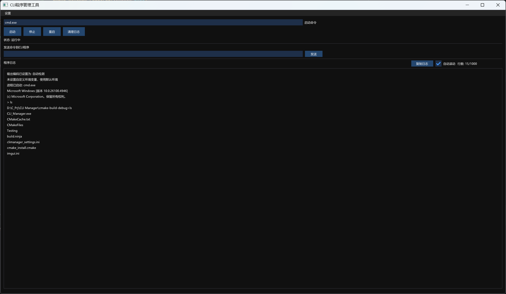
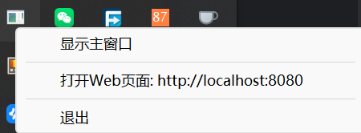

# 通用CLI管理工具

一个基于IMGUI实现的CLI管理工具，具备开机自启动、环境变量管理、自动编码识别转换和托盘持久化等功能。

## 主要功能

### 命令管理

- **命令历史记录**：自动记录执行过的命令，支持命令去重和历史记录数量限制
- **命令执行**：便捷地向CLI发送命令并获取执行结果

### 环境变量管理

- 查看当前环境变量
- 添加/删除/清空环境变量
- 为每个CLI进程设置独立的环境变量

### 编码支持

- 自动识别命令输出编码
- 支持多种编码格式转换
- UTF-8编码检测和转换

### 工作目录管理

- 获取和设置工作目录
- 支持从命令中提取目录路径
- 路径有效性验证

### 系统集成

- 系统托盘集成，支持最小化到托盘
- 开机自启动选项
- 剪贴板集成，支持日志复制

### 其他特性

- 多线程安全的数据访问
- Web服务快捷打开
- 直观的图形界面

## 程序效果

## 技术实现

- 基于IMGUI构建用户界面
- 使用C++标准库实现核心功能
- 在Windows平台上提供完整的进程管理
- 线程安全设计，适用于多线程环境

## 系统要求

- Windows操作系统
- 支持现代C++编译器

## 使用指南

### 命令执行

1. 在命令输入框中输入需要执行的命令
2. 点击执行按钮或按Enter键发送命令
3. 命令输出将实时显示在日志区域

### 环境变量配置

1. 在环境变量面板中查看当前变量
2. 使用添加/删除按钮管理环境变量
3. 所有修改将即时应用到当前CLI进程

### 工作目录设置

1. 使用工作目录下拉框选择或手动输入目录路径
2. 系统会自动验证目录有效性
3. 可从命令中自动提取目录路径

### 托盘功能

1. 最小化应用时将自动缩小到系统托盘
2. 右键托盘图标可访问快捷菜单
3. 支持通过托盘快速恢复窗口或退出应用

## 开发者信息

本项目是一个开源工具，欢迎贡献代码或提出改进建议。
